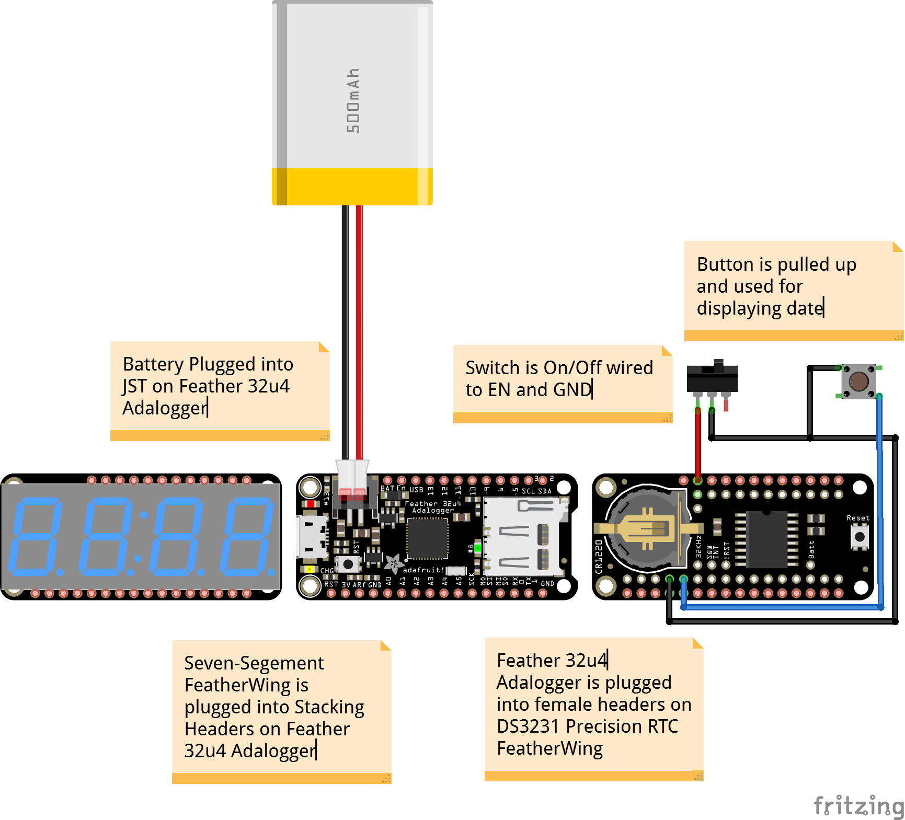

# featherwing_rtc_clock
Simple RTC Digital Clock with Adafruit Feather/FeatherWings

Feather / FeatherWings used
* [Adafruit Feather 32u4 Adalogger](https://www.adafruit.com/product/2795)
* [Adafruit DS3231 Precision RTC FeatherWing](https://www.adafruit.com/product/3028)
* [Adafruit 4-Digit 7-Segment FeatherWing](https://www.adafruit.com/product/3106)

Button for displaying text date on seven-segement dispay in format:
<DayOfWeek> <MonthAbbreviation> <Day> <Year> e.g Sun Jan 28 2018
 
Credit: showTime function is based heavily on the work by [Tony DiCola](https://github.com/adafruit/Adafruit_LED_Backpack/blob/master/examples/clock_sevenseg_ds1307/clock_sevenseg_ds1307.ino) 
and [Philip R. Moyer](https://learn.adafruit.com/7-segment-display-internet-clock/code) from Adafruit and should retain their MIT and BSD licenses

Segment alphabet values calculated using [Jose Pino's excellent Excel template](http://www.josepino.com/microcontroller/7-segment-ascii)

## Circuit Design


## License
```
MIT License

Copyright (c) 2018 Chris Fitzpatrick

Permission is hereby granted, free of charge, to any person obtaining a copy
of this software and associated documentation files (the "Software"), to deal
in the Software without restriction, including without limitation the rights
to use, copy, modify, merge, publish, distribute, sublicense, and/or sell
copies of the Software, and to permit persons to whom the Software is
furnished to do so, subject to the following conditions:

The above copyright notice and this permission notice shall be included in all
copies or substantial portions of the Software.

THE SOFTWARE IS PROVIDED "AS IS", WITHOUT WARRANTY OF ANY KIND, EXPRESS OR
IMPLIED, INCLUDING BUT NOT LIMITED TO THE WARRANTIES OF MERCHANTABILITY,
FITNESS FOR A PARTICULAR PURPOSE AND NONINFRINGEMENT. IN NO EVENT SHALL THE
AUTHORS OR COPYRIGHT HOLDERS BE LIABLE FOR ANY CLAIM, DAMAGES OR OTHER
LIABILITY, WHETHER IN AN ACTION OF CONTRACT, TORT OR OTHERWISE, ARISING FROM,
OUT OF OR IN CONNECTION WITH THE SOFTWARE OR THE USE OR OTHER DEALINGS IN THE
SOFTWARE.
```